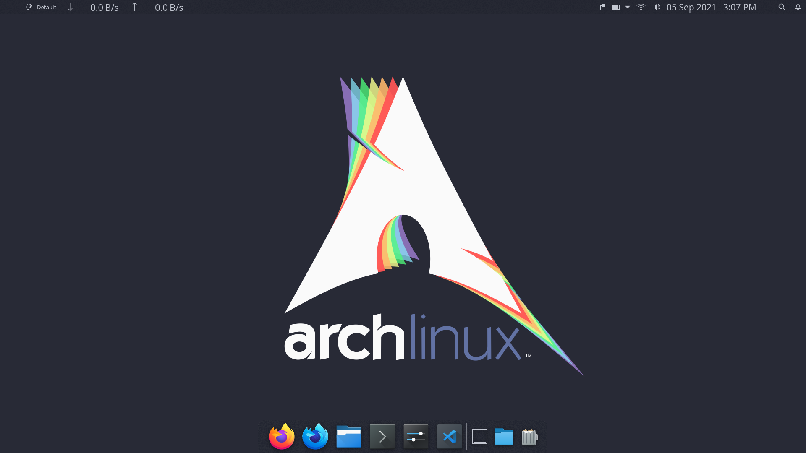

# My Linux Dot Files

All the dot files for configure my Linux with KDE Desktop Environment.



## Installation

### Dependency and packages
```bash
git clone https://github.com/jaikarans/mylinux-dotfiles.git
cd mylinux-dotfiles
sudo ./install-packages.sh
sudo ./dependent-plasmoids.sh
./install-pasmoids.sh
```

### Configuration
```bash
cp -r .config/ ~/.config/
cp ./.bashrc ~/.bashrc
cp ./.vimrc ~/.vimrc
cp -r .local/ ~/.local/
```

### Themes

#### Dracula Theme
```bash
./dracula-theme/fish.sh
./dracula-theme/vim.sh
```

## License
[MIT](https://choosealicense.com/licenses/mit/)
